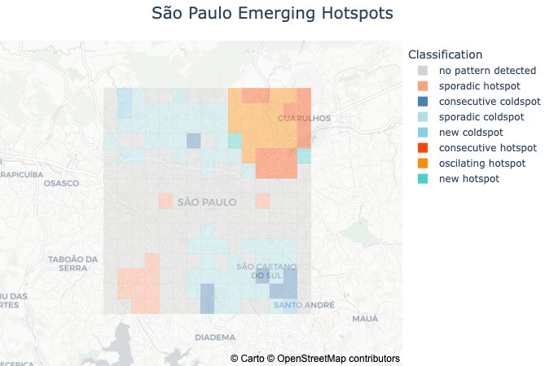

# PyEhsa: Emerging Hot Spot Analysis in Python

[](https://badge.fury.io/py/pyehsa)
[](https://pypi.org/project/pyehsa)
[](https://opensource.org/licenses/MIT)
[](https://github.com/cloudwalk/PyEhsa/actions/workflows/tests.yml)

**PyEhsa** is a Python library for **Emerging Hot Spot Analysis (EHSA)** of spatio-temporal data, providing functionality similar to R's `sfdep` package. It enables researchers and analysts to identify and classify spatial-temporal patterns, emerging hotspots, and coldspots in geographic data.

## Key Features

- **Emerging Hot Spot Analysis**: Identify emerging patterns in spatio-temporal data
- **Spatial Statistics**: Calculate Getis-Ord Gi* statistics for hotspot detection  
- **Mann-Kendall Trend Analysis**: Detect trends in time series data
- **Multiple Classifications**: Comprehensive hotspot pattern classification
- **Interactive Visualization**: HTML tool with time series analysis and mapping
- **Flexible Data Input**: Support for pandas DataFrames and GeoPandas GeoDataFrames

## Installation

```bash
pip install pyehsa
```

## Requirements

- Python 3.9+
- pandas >= 1.5.0
- geopandas >= 0.13.0  
- numpy >= 1.21.0
- scipy >= 1.9.0
- libpysal >= 4.6.0

## Quick Start Guide

### Step 1: Import Libraries

```python
import pandas as pd
import geopandas as gpd
from datetime import datetime, timedelta
from pyehsa import EmergingHotspotAnalysis
```

### Step 2: Prepare Your Data

Your dataset should have:
- **`region_id`**: Spatial identifier (e.g., 'location_001', 'geohash_abc')
- **`time_period`**: Temporal column (datetime format)
- **`value`**: Numeric variable to analyze
- **`geometry`**: Spatial geometry (Point or Polygon from shapely)

```python
# Example: Create or load your GeoDataFrame
data = pd.DataFrame({
    'region_id': ['area_1', 'area_1', 'area_2', 'area_2'],
    'time_period': [datetime(2024, 1, 1), datetime(2024, 2, 1), 
                    datetime(2024, 1, 1), datetime(2024, 2, 1)],
    'value': [10.5, 15.2, 8.3, 12.1],
    'geometry': [polygon_1, polygon_1, polygon_2, polygon_2]  # Your geometries
})

gdf = gpd.GeoDataFrame(data, geometry='geometry', crs='EPSG:4326')
```

### Step 3: Run Emerging Hot Spot Analysis

```python
results = EmergingHotspotAnalysis.emerging_hotspot_analysis(
    gdf,
    region_id_field='region_id',
    time_period_field='time_period',
    value='value',
    k=1,      # Temporal lags to include
    nsim=99   # Monte Carlo simulations for significance testing
)
```

**Parameter Details:**

- **`region_id_field`** (str): Name of the column containing spatial region identifiers. This column uniquely identifies each geographic area in your analysis (e.g., 'geohash_6', 'zip_code', 'grid_id').

- **`time_period_field`** (str): Name of the column containing temporal information. Must be in datetime format. This defines the time periods for the spatio-temporal analysis (e.g., 'month', 'date', 'time_period').

- **`value`** (str): Name of the column containing the numeric values to analyze. This is the variable you want to detect hotspots for (e.g., 'crime_count', 'sales', 'temperature').

- **`k`** (int, default=1): Number of temporal lags to include in the analysis. This defines how many previous time periods should be considered as temporal neighbors.
  - `k=1`: Only includes the immediate previous time period (most common)
  - `k=2`: Includes the two previous time periods
  - `k=3`: Includes the three previous time periods
  - Higher k values capture longer temporal dependencies but require more time periods in your data

- **`nsim`** (int, default=99): Number of Monte Carlo simulations for statistical significance testing. Higher values provide more robust p-values but increase computation time.
  - `nsim=99`: Fast, suitable for exploratory analysis
  - `nsim=199`: Balanced (matches R's default)
  - `nsim=999`: High precision for final analyses
  - Minimum recommended: 99

### Step 4: View Results

```python
# See classification distribution
print(results['classification'].value_counts())

# View detailed results
results.head()
```

### Step 5: Create Interactive Visualization

```python
from pyehsa import EhsaPlotting

# Merge geometry with results for visualization
locations = gdf[['region_id', 'geometry']].drop_duplicates()
viz_data = results.merge(locations, left_on=results.columns[0], right_on='region_id')

# Create interactive map
ehsa_map = EhsaPlotting.plot_ehsa_map_interactive(
    df=viz_data,
    region_id_field='region_id',
    title="Emerging Hotspots Analysis"
)
ehsa_map.show()
```

<p align="center">
  
</p>

## Classification Types

PyEhsa identifies 17 different spatio-temporal patterns:

**Hotspot Patterns:**
- **new hotspot**: Recently emerged statistically significant hotspot (significant only in final time period)
- **consecutive hotspot**: Hotspot significant for multiple consecutive recent periods with <90% overall significance
- **intensifying hotspot**: Hotspot significant in ≥90% of time periods with statistically significant increasing trend
- **persistent hotspot**: Hotspot significant in ≥90% of time periods with no significant trend
- **diminishing hotspot**: Hotspot significant in ≥90% of time periods with statistically significant decreasing trend
- **sporadic hotspot**: On-and-off hotspot with some significant periods but no clear pattern
- **oscillating hotspot**: Hotspot that alternates between significant and non-significant with majority being significant
- **historical hotspot**: Only significant in ≥90% of early time periods but not recent periods

**Coldspot Patterns:**
- **new coldspot**: Recently emerged statistically significant coldspot
- **consecutive coldspot**: Coldspot significant for multiple consecutive recent periods
- **intensifying coldspot**: Coldspot significant in ≥90% of periods with significant increasing intensity trend
- **persistent coldspot**: Coldspot significant in ≥90% of periods with no significant trend
- **diminishing coldspot**: Coldspot significant in ≥90% of periods with significant decreasing intensity trend
- **sporadic coldspot**: On-and-off coldspot with intermittent significant periods
- **oscillating coldspot**: Coldspot that alternates between significant and non-significant states
- **historical coldspot**: Only significant in early time periods but not recent

**No Pattern:**
- **no pattern detected**: Areas without statistically significant spatial-temporal patterns

## Advanced Usage

### Interactive HTML Visualization Tool

PyEhsa includes a powerful interactive HTML visualization tool for exploring your EHSA results:

```python
# Step 1: Save your results to CSV
results.to_csv('ehsa_results.csv', index=False)

# Step 2: Launch the interactive visualization tool
from pyehsa import EhsaPlotting
EhsaPlotting.open_visualization_tool()
```

This will open an interactive HTML tool in your browser where you can:
1. **Upload your CSV**: Click "Choose File" and select `ehsa_results.csv`
2. **Explore the map**: Interactive visualization of all spatial patterns
3. **Inspect time series**: Click any region and select "Inspect Time Series" to see temporal trends
4. **View statistics**: Detailed Mann-Kendall statistics and classification details for each region

The visualization tool provides deep insights into your spatio-temporal patterns with interactive charts and detailed region analysis.

## Complete Example

See `examples/demo_sp.ipynb` for a complete working example with:
- Synthetic grid data covering São Paulo
- Full EHSA workflow from data creation to visualization
- Interactive map generation

## Contributing

We welcome contributions! Please:
1. Fork the repository
2. Create a feature branch (`git checkout -b feature/amazing-feature`)
3. Commit your changes (`git commit -m 'Add amazing feature'`)
4. Push to the branch (`git push origin feature/amazing-feature`)
5. Open a Pull Request

## Citation

If you use PyEhsa in your research, please cite:

```bibtex
@software{pyehsa2025,
  author = {CloudWalk},
  title = {PyEhsa: Emerging Hot Spot Analysis in Python},
  year = {2025},
  url = {https://github.com/cloudwalk/PyEhsa},
  version = {0.1.0}
}
```

## License

This project is licensed under the MIT License - see the [LICENSE](LICENSE) file for details.

## Related Work

PyEhsa is inspired by and provides similar functionality to:
- R's `sfdep` package for spatial dependence analysis
- ArcGIS's Emerging Hot Spot Analysis tool
- PySAL ecosystem for spatial analysis

## Development & Support

- **Repository**: [github.com/cloudwalk/PyEhsa](https://github.com/cloudwalk/PyEhsa)
- **Issues**: [GitHub Issues](https://github.com/cloudwalk/PyEhsa/issues)
- **PyPI**: [pypi.org/project/pyehsa](https://pypi.org/project/pyehsa)

## Acknowledgments

Developed by CloudWalk's data science team to provide open-source spatial analysis tools for the Python community.